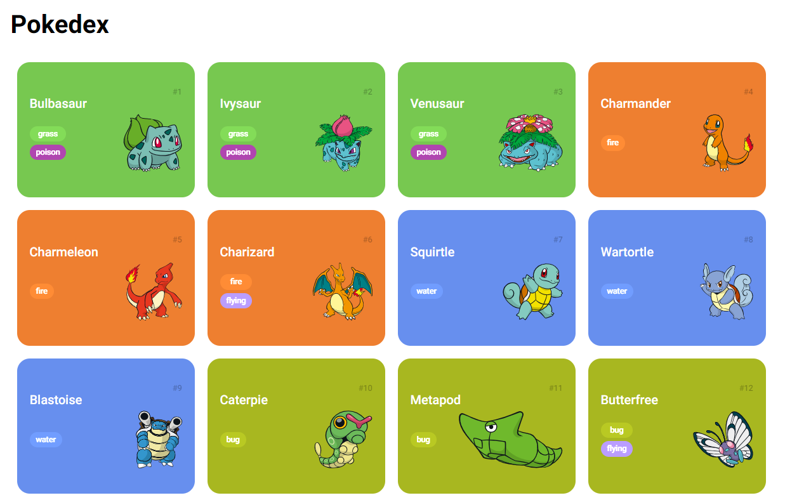

# Formação JavaScript Developer - DIO
Este repositório contém exercícios e projetos realizados durante a formação JavaScript Developer da DIO.

## Módulo I
Focado em lógica de programação e fundamentos da sintaxe do JavaScript. Inclui exercícios de aprendizado.

## Módulo II
Desenvolvimento de uma Pokedex usando a API PokeApi. Utiliza HTML, CSS, e JavaScript para exibir uma lista de Pokémons e suas informações.

  ### Tecnologias Utilizadas
  - JavaScript
  - HTML
  - CSS  
  - PokeApi
    
  

